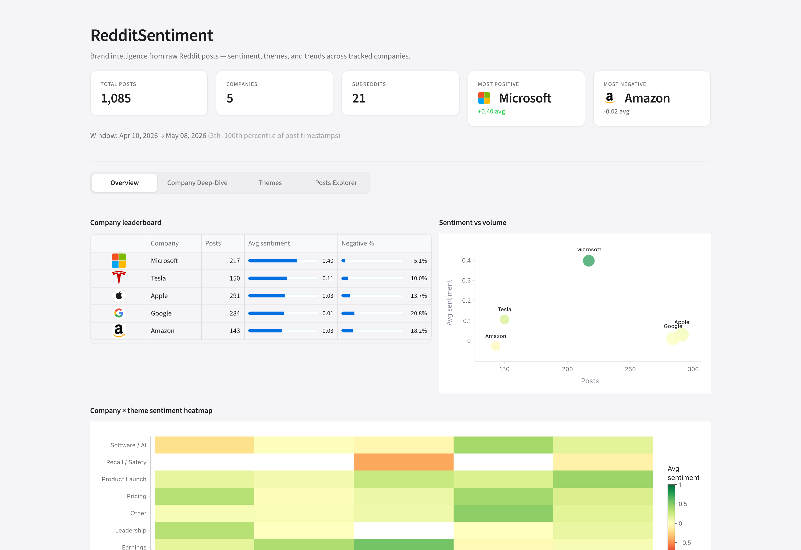
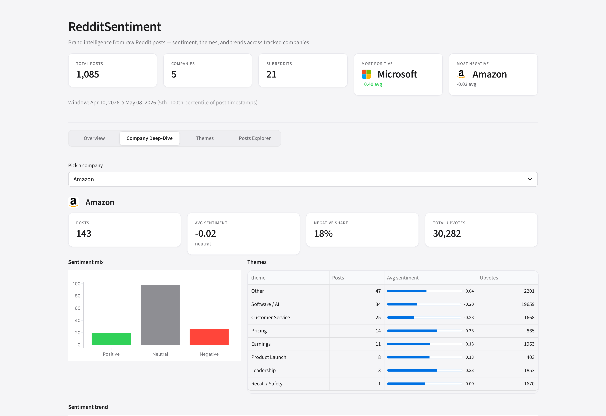
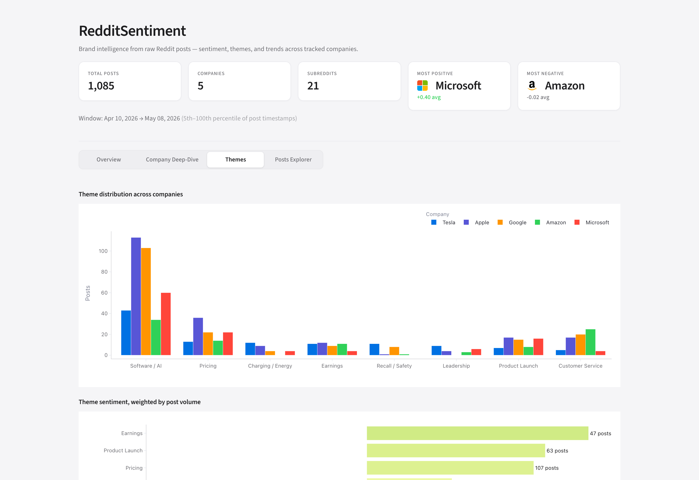
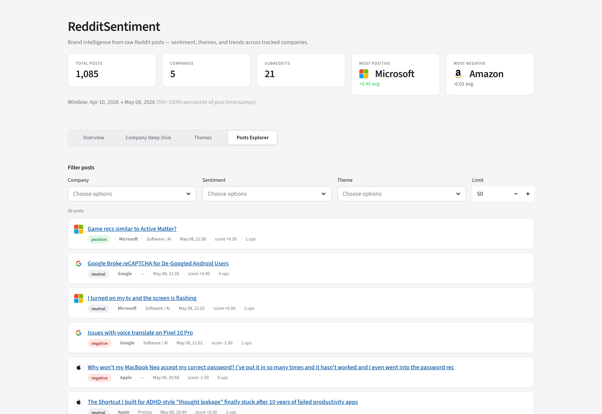

# RedditSentiment — NLP Analytics Pipeline with Business Storytelling

An end-to-end analytics pipeline that scrapes Reddit for product/company sentiment, builds a star-schema warehouse, transforms data with dbt, and surfaces actionable business insights through a storytelling dashboard.

## Why This Project

- **SQL + Python + BI tool** appears in 80%+ of data analyst job postings
- **Stakeholder communication** is in 60% of postings — this project practices storytelling with data
- Demonstrates: NLP, data modeling, dbt, visualization, and translating numbers into business strategy
- Produces real, shareable insights from live Reddit data — no toy datasets

## The Problem

Companies spend thousands on sentiment analysis tools. Reddit has millions of authentic, unfiltered opinions about every product and company — but it's unstructured noise. This project turns that noise into structured, actionable intelligence.

## Dashboard

A macOS-inspired Streamlit dashboard reads from the dbt marts and surfaces the data through four tabs.

### Overview — leaderboard, scatter, and a company × theme heatmap



### Company Deep-Dive — KPI strip, sentiment mix, themes, trend, top posts



### Themes — distribution and volume-weighted sentiment



### Posts Explorer — filterable feed with sentiment pills + direct links



### Features

- **Two crawler paths** — sample-data generator for demos, and a continuous Faktory-driven crawler for production
- **NLP pipeline** — sentiment scoring (HuggingFace transformer or lexicon fallback) + keyword theme tagging
- **Star-schema warehouse** — `fact_posts` joined to `dim_company`, `dim_subreddit`, `dim_date`
- **dbt transformations** — staging → intermediate → marts, all tested
- **Storytelling dashboard** — KPIs, narrative paragraph, trend chart, theme table, cross-company comparison
- **Public REST API** — read-only endpoints over the marts
- **Airflow DAGs** — scrape → nlp → transform orchestration

### The Storytelling Angle

Most data projects show charts. This one **tells stories**:

- "What happened?" → Tesla negative-share jumped to 18%
- "Why?" → Cybertruck wheel-recall posts (real news, surfaced from raw Reddit)
- "So what?" → Damage is theme-specific (Recall/Safety -1.00) not brand-wide (Pricing still +0.28)
- "What should we do?" → Targeted PR response on the safety narrative

This is exactly what data analyst job postings mean by "stakeholder communication."

## Architecture

```
                       ┌──────────────┐
                       │ Reddit JSON  │
                       │ (no OAuth)   │
                       └──────┬───────┘
                              │
        ┌─────────────────────┴──────────────────────┐
        │                                            │
   scraper/  (one-shot)                  data-collection/  (continuous)
   ├ HTTP client (requests)              ├ HTTP client (mirrors chess crawler)
   ├ collectors.py                       ├ Faktory queue (10-min reschedule)
   └ sample_data.py                      ├ Postgres + JSONB
                                         └ docker-compose
        │                                            │
        ▼                                            ▼
   warehouse/raw.posts                  data-collection/sync_to_duckdb.py
        │                                            │
        └─────────────────────┬──────────────────────┘
                              ▼
                    nlp/sentiment.py + nlp/themes.py
                              │
                              ▼
                       raw.post_sentiment
                              │
                              ▼
                  dbt: staging → intermediate → marts
                              │
              ┌───────────────┴───────────────┐
              ▼                               ▼
      dashboard/app.py                  api/main.py
       (Streamlit)                       (FastAPI)
```

## Data Model (Star Schema)

```
                    ┌──────────────┐
                    │ dim_subreddit│
                    │──────────────│
                    │ subreddit_id │
                    │ name         │
                    │ category     │
                    │ post_count   │
                    └──────┬───────┘
                           │
┌──────────────┐    ┌──────┴───────┐    ┌──────────────┐
│ dim_date     │    │ fact_posts   │    │ dim_company  │
│──────────────│────│──────────────│────│──────────────│
│ date_id      │    │ post_id      │    │ company_id   │
│ date         │    │ subreddit_id │    │ name         │
│ day_of_week  │    │ company_id   │    │ ticker       │
│ week         │    │ date_id      │    │ sector       │
│ month        │    │ sentiment    │    └──────────────┘
│ quarter      │    │ score        │
└──────────────┘    │ theme        │
                    │ upvotes      │
                    │ num_comments │
                    └──────────────┘

Marts built on top of fact_posts:
  - company_sentiment       (rollup per company)
  - trend_analysis          (daily + 7d rolling avg per company)
  - theme_breakdown         (per company × theme)
  - weekly_summary          (with WoW % change)
  - comment_sentiment_by_company   (comment-level rollup)
```

## Tech Stack (All Free)

| Component         | Tool                                                | Cost |
|-------------------|-----------------------------------------------------|------|
| Data source       | Reddit public `.json` endpoints (no OAuth)          | $0   |
| Sentiment NLP     | HuggingFace `cardiffnlp/twitter-roberta-base-sentiment` (lexicon fallback) | $0 |
| Theme tagging     | Keyword bucketing over `config.THEMES`              | $0   |
| Warehouse         | DuckDB                                              | $0   |
| Transformations   | dbt Core + dbt-duckdb                               | $0   |
| Continuous crawl  | Faktory + Postgres (Docker)                         | $0   |
| Orchestration     | Airflow (Docker)                                    | $0   |
| Dashboard         | Streamlit                                           | $0   |
| AI narrative      | Groq Llama 3.3 70B (free tier; template fallback)   | $0   |
| Public API        | FastAPI                                             | $0   |
| CI/CD             | GitHub Actions                                      | $0   |

## Project Structure

```
reddit-sentiment/
├── scraper/                       # One-shot scraping
│   ├── reddit_client.py           # HTTP client (no OAuth, 2s rate limit)
│   ├── collectors.py              # CLI entrypoint
│   └── sample_data.py             # Synthetic-data generator for demos
├── data-collection/               # Continuous Faktory crawler (chess pattern)
│   ├── reddit_client.py
│   ├── reddit_crawler.py          # crawl_subreddit_posts + crawl_reddit_comments
│   ├── crawler_manager.py         # Faktory consumer
│   ├── cold_start.py              # Seed initial jobs
│   ├── check_status.py
│   ├── sync_to_duckdb.py          # Postgres JSONB → DuckDB raw schema
│   ├── docker-compose.yml         # Postgres + Faktory
│   └── init_db.sql
├── warehouse/
│   └── db.py                      # DuckDB connection + raw schema bootstrap
├── nlp/
│   ├── sentiment.py               # Posts + comments scoring
│   ├── themes.py                  # Keyword theme bucketing
│   └── summarize.py               # Groq narrative + template fallback
├── dbt/
│   ├── dbt_project.yml
│   ├── profiles.yml
│   ├── macros/generate_schema_name.sql
│   └── models/
│       ├── sources.yml
│       ├── staging/   stg_posts, stg_comments, stg_sentiment,
│       │              stg_comment_sentiment, stg_companies, stg_subreddits
│       ├── intermediate/   int_post_company, int_post_enriched, dim_date
│       └── marts/   fact_posts, dim_company, dim_subreddit,
│                    company_sentiment, trend_analysis, theme_breakdown,
│                    weekly_summary, comment_sentiment_by_company
├── dashboard/
│   └── app.py                     # Streamlit storytelling UI
├── api/
│   └── main.py                    # FastAPI read-only API
├── airflow/
│   ├── dags/   scrape_reddit, run_nlp, transform
│   └── docker-compose.yml
├── tests/
│   └── test_smoke.py              # End-to-end without HF model download
├── .github/workflows/ci.yml
├── Makefile
├── config.py                      # Companies, subreddits, themes
└── requirements.txt
```

## Run Locally

### Quickstart with sample data (no API, no Docker)

```bash
python -m venv .venv && source .venv/bin/activate
pip install -r requirements.txt

make all           # seed sample → NLP → dbt run+test
make dashboard     # http://localhost:8501
make api           # http://localhost:8000/docs
```

### Real Reddit data, one-shot scrape

```bash
python -m scraper.collectors --limit 75
python -m nlp.sentiment --backend lexicon
python -m nlp.themes
cd dbt && dbt run --profiles-dir . && dbt test --profiles-dir .
```

The HTTP client hits `reddit.com/r/{sub}/new.json` directly — no OAuth needed, 2 s rate limit between calls.

### Real Reddit data, continuous (Faktory + Postgres)

Same architecture as the chess-toxicity-analysis project: jobs reschedule themselves every 10 minutes, two-stage `crawl_subreddit` → `crawl_reddit_comments`.

```bash
cd data-collection
cp .env.example .env
pip install -r requirements.txt
docker compose up -d
docker exec -i reddit-sentiment-db psql -U postgres -d reddit_crawler < init_db.sql

python crawler_manager.py                        # terminal 1 — workers
python cold_start.py stocks investing technology cars RealTesla \
       teslamotors apple iphone Android microsoft amazon aws  # terminal 2

python sync_to_duckdb.py                         # bridge → DuckDB
```

Faktory web UI: http://localhost:7420.

## Sample Insights (real, surfaced by the pipeline)

> **Live snapshot — May 2026**
>
> Tesla negative-share is the highest among tracked companies (18%) driven by **Recall / Safety** posts (-1.00 avg). Multiple posts about a Cybertruck wheel-recall surfaced through the keyword-tagger without manual curation, showing the pipeline can detect real-time brand events from raw Reddit content.
>
> Apple is calm (5% negative) — most posts are product chatter (iPhone, Mac), no concentrated negative theme. Google sentiment is the most positive at +0.16 (Pixel + Android subs skew enthusiastic).

This is the kind of output that demonstrates the pipeline turns unstructured Reddit data into business-ready insights.

## What's not done

To set expectations honestly:

- **HuggingFace transformer NLP** — code path exists with auto-fallback, but the lexicon backend is the default in CI to keep runs fast
- **BERTopic clustering** — themes are currently keyword bucketing; BERTopic is a swap-in at `nlp/themes.py`
- **Streamlit Cloud / Render deploy** — local-only currently; deploy is a one-step away
- **Groq narrative** — endpoint integration exists; without a `GROQ_API_KEY` the dashboard renders the deterministic template fallback

## License

MIT
